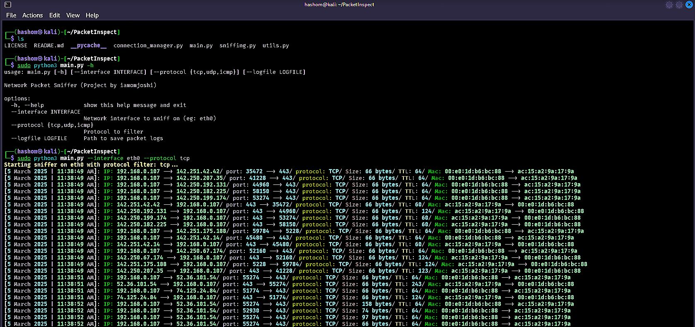

# PacketInspect
Network Packet Sniffer

**PacketInspect** is a Python-based network packet sniffing tool that leverages the power of the Scapy library. It allows users to capture, analyze, and manage network traffic in real-time, making it an essential utility for cybersecurity enthusiasts and professionals.

## Key Features

- **Real-Time Sniffing**: Monitor network packets on a specified interface.
- **Protocol Filtering**: Capture packets filtered by TCP, UDP, or ICMP protocols.
- **Detailed Logging**: Log essential packet information, including timestamps, source and destination IPs, ports, and protocols.
- **Connection Termination**: Terminate active TCP connections using the `RST` flag.
- **User-Friendly Output**: Present captured packet information in a colorful and readable format.

## Table of Contents

- [Installation](#installation)
- [Usage](#usage)
- [File Descriptions](#file-descriptions)
- [Contributing](#contributing)
- [License](#license)

## Installation

To get started with PacketInspect, ensure you have Python 3.x installed on your system. Then follow these steps:

1. **Clone the Repository**:
   ```bash
   git clone https://github.com/iamomjoshi/PacketInspect.git
   cd PacketInspect
   ```

2. **Install Required Packages**:
   ```bash
   pip install scapy rich
   ```

3. **Run the Tool with Root Privileges**: Packet sniffing requires elevated permissions. Run the following command as root or using `sudo`.

## Usage

To start sniffing packets, use the following command format:

```bash
sudo python main.py --interface <network_interface> --protocol <tcp|udp|icmp> --logfile <path_to_logfile>
```

### Example

To sniff TCP packets on the `eth0` interface and log them to `packet_log.txt`, use:

```bash
sudo python main.py --interface eth0 --protocol tcp --logfile packet_log.txt
```


## File Descriptions

- **`main.py`**: The main entry point that handles command-line argument parsing and initiates packet sniffing.
  
- **`sniffing.py`**: Contains functions for sniffing packets, logging packet data, and processing captured packets.

- **`connection_manager.py`**: Implements functionality to terminate TCP connections by sending a reset packet.

- **`utils.py`**: Provides utility functions for checking permissions and error handling.

## Contributing

Contributions to PacketInspect are welcome! If you have suggestions for enhancements or additional features, please open an issue or submit a pull request.

## License

This project is licensed under the MIT License. See the [LICENSE](LICENSE) file for more information.

---

*Project developed by [iamomjoshi](https://github.com/iamomjoshi)*
```
